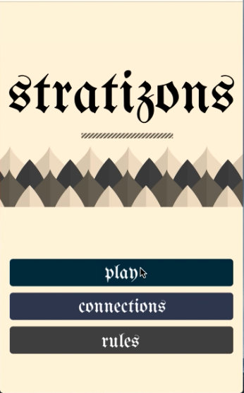
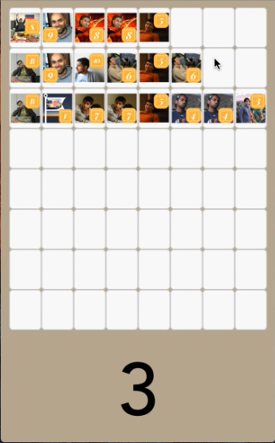
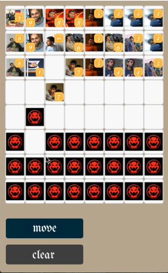

# stratego

My first attempt at making a game in react native.

Game Play Setup:
1. Set Up Board - Strategically place your pieces.
2. Wait for your opponent to set up his game pieces.
3. Battle. Select piece to indicate decision to move. Select location to move to. Press move.
4. Capture the flag to win

Basic Rules:
The goal of the game is to capture the opposing player's flag. You do not know where the flag is. Players take turn moving
pieces. Most pieces can only move one space at a time. When two players meet at the same square a battle ensues. The piece with
higher rank wins control of the square. If two players are of equal rank, the defending piece maintains control. Don't be so
quick to attack. You do not want your opponent to know your pieces. After a battle, the rank of the victor is revealed briefly.
It is up to you to remember pieces that have already been revealed.

Special Pieces:
Flag: Protect at all cost. Cannot Move once it is set.\n
Bomb: Cannot move. Will win any battle.\n
Spy: Defensively outranked by all players, but uses his cunning to offensively outrank all opponents. Be careful how you use
the spy. He is your only hope to defeated your opponent's rank 10 piece. \n
Rank 2: Has the ability to move multiple squares in one direction at a time. Similar to a rook. This is advantageous for
making direct strikes on the flag or for scouting out your opponents pieces. \n
Rank 3: Will defuse a bomb. The only piece that will gain control of a square occupied by a bomb. \n
\n

